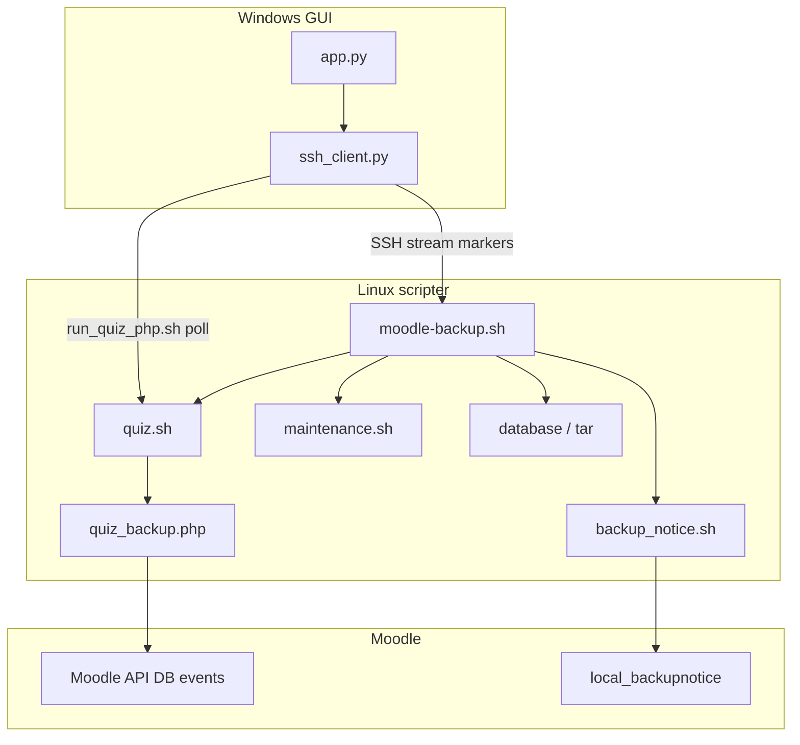
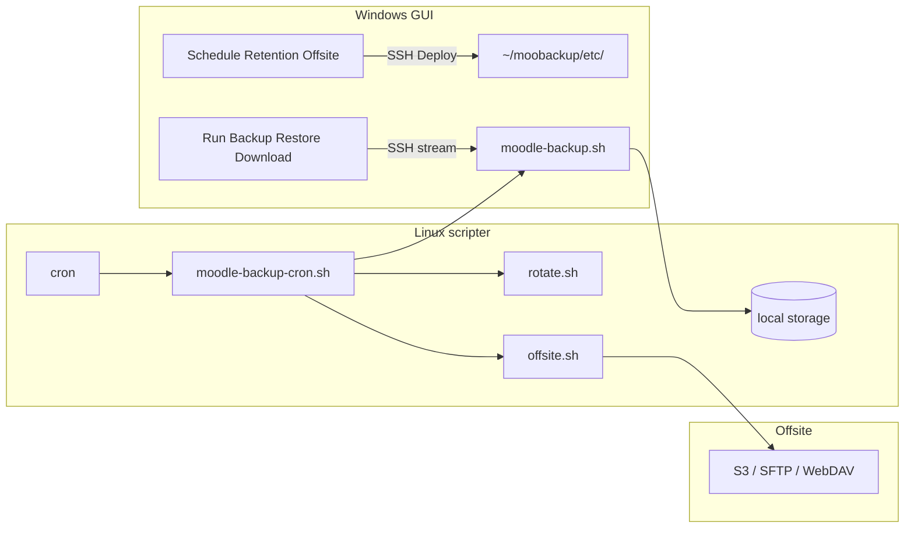

# План системы резервного копирования Moodle

> **Назначение документа:** единый контекст для продолжения работы без истории чата.  
> **Статус:** реализовано и отлажено на production-хосте (Moodle 5.1, пользователь `scripter`).  
> **Последнее обновление:** 25 июня 2026.

Пользовательская документация: [README.md](README.md).

---

## Контекст

**Moo-backup** — bash-бэкапер на Linux + Windows GUI (tkinter/paramiko).

- Пользователь бэкапа (`scripter`): read Moodle + dataroot, write storage + корень dataroot (ACL или иные средства на сетевом томе).
- Quiz-операции: **Moodle API** через `quiz_backup.php`, процесс **пользователя бэкапа** (ACL CLI bootstrap в dataroot).
- Restore под `scripter` **не тестировался**.

### Конфигурация

| Уровень | Файл | Содержимое |
|---------|------|------------|
| Windows GUI | `gui/profiles.json` | SSH, пути, секреты |
| Windows GUI | `gui/keys/<id>/` | Ed25519 ключи |
| Linux host | `~/moobackup/bin/moodle-backup.env` | `BACKUPER_*`, опционально `MOOBACKUP_QUIZ_PHP` |

Шаблоны: `gui/profiles.json.example`, `remote/moodle-backup.env.example`.

### Production (пример)

| Параметр | Значение |
|----------|----------|
| SSH | `192.0.2.1`, login `scripter` |
| Moodle root | `/var/www/moodle` |
| Dataroot | `/data/moodata` |
| Storage | `/home/scripter/moobackup` |
| Site | `https://moodle.example.org` |

---

## Архитектура



**Формат:** каталог `YYYY-MM-DD_HH-MM-SS/` с multi-file (без финального `.tar.gz`).

---

## Структура репозитория

```
Moo-backup/
├── README.md, PLAN.md, run-gui.bat, requirements.txt
├── remote/
│   ├── moodle-backup.sh
│   ├── setup-moodledata-acl.sh
│   ├── moodle-backup.env.example
│   └── lib/
│       ├── common.sh, config.sh, logging.sh, permissions.sh
│       ├── maintenance.sh, backup_notice.sh
│       ├── database.sh, archive.sh, plugins.sh, progress.sh
│       ├── quiz.sh                      # quiz_php, capture JSON, wait loop
│       ├── quiz_backup.php              # Moodle API CLI
│       ├── run_quiz_php.sh              # обёртка для GUI poll
│       └── parse_config.php
│   # (план) moodle-backup-cron.sh, moodle-backup-rotate.sh, moodle-backup-offsite.sh
│   # (план) ~/moobackup/etc/ — schedule.env, retention.env, offsite.env (на хосте)
├── moodle-plugin/local/backupnotice/
├── restore/moodle-restore.sh, RESTORE.md
└── gui/ … app.py, ssh_client.py, profiles.py
```

---

## Компонент 1: `moodle-backup.sh`

### Алгоритм

1. Args: `--full`, `--simulate`, `--simulate-seconds N`, `--force`, `--no-quiz-prep`, ...
2. `load_env` → `init_backup_dirs` → `@BACKUP_DIR` → `init_logging` (tee).
3. `load_moodle_config` (`parse_config.php`), probe dataroot write.
4. `trap cleanup EXIT`.

**Quiz prep** (если не `--no-quiz-prep`):

5. `verify_quiz_runner` — пробный `list` от пользователя бэкапа.
6. `prepare_quiz_for_backup`: env-check → list → banner (`backup-notice.json`).
7. `wait_for_open_quiz_attempts`: poll 30 с; блок новых попыток — только quizaccess rule.

**Архивация:**

8. Maintenance ON → remove banner.
9. DB / code / moodledata / finalize (или `simulate_backup_data`, delay по `--simulate-seconds`, default 5).
10. Maintenance OFF.

---

| Код | Константа | Смысл |
|-----|-----------|--------|
| 0 | OK | |
| 1 | CONFIG | env, пути |
| 3 | DATABASE | dump |
| 4 | ARCHIVE | tar/gzip |
| 5 | CANCELLED | cancel в quiz wait |
| 6 | QUIZ | ACL CLI bootstrap, quiz_backup.php, плагин |

### stdout-маркеры (GUI)

| Маркер | Назначение |
|--------|------------|
| `@BACKUP_DIR path` | Каталог бэкапа (control file) |
| `@PROGRESS step pct msg` | Progress bar |
| `@QUIZ_ATTEMPTS {json}` | Таблица попыток |
| `@BACKUP_WAIT start\|poll\|done\|timeout …` | Фаза ожидания; Force/Cancel в GUI |

### Quiz: технические детали

- **`quiz_php`**: прямой вызов php; default `/usr/bin/php`, override `MOOBACKUP_QUIZ_PHP`.
- **`quiz_php_capture`**: stdout во tempfile (обход конфликта `exec > tee` с `$()`).
- **`quiz_backup.php`**: полный Moodle bootstrap; `list`, `env-check`, `contrib-list`.
- **Баннер**: `dataroot/backup-notice.json`; ETA = max quiz deadline + buffer.

### Simulate (`--simulate`)

Quiz-flow и maintenance без изменений; вместо dump/tar — `sleep N` (`--simulate-seconds`, default 5); `manifest.json`: `"simulated": true`, `"simulate_seconds": N`.

---

## Компонент 2: Права на dataroot

| Режим | Кто запускает | Что делает |
|--------|---------------|------------|
| `setup-moodledata-acl.sh` (полный) | root | POSIX ACL: read tree, write dataroot root, write CLI bootstrap (temp/cache/localcache/muc) |
| `setup-moodledata-acl.sh --check-only` | пользователь бэкапа | Проверка **фактических** прав; ACL на ФС не требуется; `--user` по умолчанию = текущий пользователь |

На сетевом dataroot без ACL: достаточно `--check-only`; полный скрипт не нужен, если права выданы иным способом.

---

## Компонент 3: Windows GUI

### Раскладка (`app.py`)

- Connection bar, backup bar (Full / Simulate / Run / Force / Cancel / Restore / Deploy).
- Remote/Local lists, quiz Treeview, progress, log.
- **Status bar** внизу (упаковывается первой — видна сразу при запуске): профиль/host/paths слева, `Connected ok` / `Disconnected` справа.
- **Первый запуск:** без `gui/profiles.json` — модальное окно **Connections** (Retry при закрытии без Save).
- Poll quiz: `run_quiz_php.sh` каждые 30 с в фазе `@BACKUP_WAIT`.

### Deploy (`ssh_client.py`)

- Upload `remote/` + `restore/` → `~/moobackup/bin/`.
- `moodle-backup.env` с `BACKUPER_*`.
- `chmod +x`, `sed` CRLF.
- `PROJECT_ROOT` для Deploy читает `remote/` и `restore/` относительно корня дистрибутива (см. [Сборка Windows-дистрибутива](#сборка-windows-дистрибутива-pyinstaller)).
- Планируемое расширение: **Deploy automation** (cron, ротация, offsite) — см. [Автоматизация на хосте](#автоматизация-на-хосте-cron-ротация-offsite).

---

## Сборка Windows-дистрибутива (PyInstaller)

> **Статус:** реализовано (`build-gui.ps1`, `moo-backup.spec`, `gui/paths.py`). Артефакт: `dist/Moo-backup-portable.zip`.

### Цель

Запуск GUI на целевой Windows-машине **без** установки Python, venv и `pip install`. Разработка и отладка по-прежнему через `run-gui.bat` и `.venv`.

### Режим PyInstaller

| Режим | Рекомендация |
|-------|----------------|
| `--onedir` | **Предпочтительно:** быстрый старт, папка `_internal\` с runtime, проще отладка |
| `--onefile` | Возможен, но при каждом запуске распаковка в `%TEMP%\_MEI…`; для tkinter + cryptography — крупный exe и риск ложных срабатываний AV |

Имя exe на усмотрение (например `Moo-backup.exe`); размещать в **корне пакета**, не в `gui\` рядом с `main.py`.

### Пути: dev vs frozen (обязательная доработка кода)

Один код для venv и для exe — **`gui/paths.py`**:

```python
def is_frozen() -> bool:
    return bool(getattr(sys, "frozen", False))

def app_root() -> Path:
    """Корень репозитория / дистрибутива: remote/, restore/, gui/."""
    if is_frozen():
        return Path(sys.executable).resolve().parent
    return Path(__file__).resolve().parent.parent  # родитель каталога gui/

def gui_dir() -> Path:
    return app_root() / "gui"

def bundle_dir() -> Path | None:
    """Runtime PyInstaller только для чтения из сборки."""
    meipass = getattr(sys, "_MEIPASS", None)
    return Path(meipass) if meipass else None
```

| Переменная | `run-gui.bat` (dev) | PyInstaller `--onedir` |
|------------|---------------------|-------------------------|
| `sys.frozen` | нет / `False` | `True` |
| `sys._MEIPASS` | нет | `…\Moo-backup\_internal` |
| `sys.executable` | `.venv\Scripts\pythonw.exe` | `…\Moo-backup\Moo-backup.exe` |
| `app_root()` | корень репозитория | каталог с exe |
| `gui_dir()` | `…\gui\` | `…\gui\` (рядом с exe) |

**Не использовать** `Path(sys.executable).parent` в dev — указывает на `.venv\Scripts`, не на корень проекта.

**Заменить** прямые `Path(__file__).…` в:

- `gui/config.py` — `PROJECT_ROOT`
- `gui/profiles.py` — `GUI_DIR`, `PROFILES_FILE`
- `gui/main.py` — `ROOT` / `sys.path` (в frozen обычно не нужен)

`remote/` и `restore/` для Deploy — через `app_root()`, **не** через `_MEIPASS`. Каталоги кладутся **рядом с exe**, а не только внутрь `_internal`.

### Структура дистрибутива на целевой машине

```
C:\Program Files\Moo-backup\     (или каталог, выбранный при установке)
├── Moo-backup.exe
├── _internal\                   ← только PyInstaller runtime (не трогать)
├── gui\
│   ├── profiles.json            ← создаётся GUI при работе
│   ├── profiles.json.example
│   └── keys\                    ← создаётся GUI
├── remote\                      ← копия из репозитория на момент сборки
├── restore\
└── moodle-plugin\               ← исходники + dist\*.zip для установки на новый prod
    └── dist\
        ├── local_backupnotice_moodle40-*.zip
        └── quizaccess_backupnotice_moodle40-*.zip
```

Опционально в корне пакета: `PORTABLE.txt` (краткая инструкция).

### Конвейер сборки

PyInstaller **сам** не копирует `remote\`, `restore\`, `moodle-plugin\` и шаблоны `gui\` — **`build-gui.ps1`** (PyInstaller + post-build + ZIP).

```
Репозиторий (снимок на момент сборки)
        │
        ▼  moodle-plugin/build-zip.py  →  moodle-plugin/dist/*.zip
        │
        ▼  pyinstaller --onedir … gui/main.py
dist\Moo-backup\
        ├── Moo-backup.exe
        ├── _internal\
        │
        ▼  post-build copy (build-gui.ps1)
        ├── gui\profiles.json.example
        ├── remote\
        ├── restore\
        └── moodle-plugin\  (+ dist\*.zip)
        │
        ▼  Compress-Archive
dist\Moo-backup-portable.zip
```

- **`dist\`** — каталог артефактов сборки; в git не коммитить (`dist/`, `build/` → `.gitignore`).
- Распространение: **portable ZIP** (распаковать в любой каталог; установка в Program Files не планируется).

### Что не включать в пакет

| Исключить | Причина |
|-----------|---------|
| `.venv\`, исходники `gui\*.py` | Код уже в `_internal` |
| `gui/profiles.json`, `gui/keys/` | Секреты и данные пользователя |
| `.git`, `PLAN.md`, dev-скрипты | Не нужны на боевой машине |

### Зависимости сборки (только на машине разработчика)

- Python 3.10+ (как в `run-gui.bat`)
- `pip install -r requirements.txt -r requirements-dev.txt`

### Задачи для реализации (чеклист)

- [x] `gui/paths.py` + замена `PROJECT_ROOT` / `GUI_DIR` в перечисленных модулях
- [x] `moo-backup.spec` (`--onedir`, `--windowed`, hidden-import для paramiko/cryptography)
- [x] `build-gui.ps1`: pyinstaller → plugin ZIPs → копирование `remote/`, `restore/`, `moodle-plugin/`, `gui/profiles.json.example` → `dist/Moo-backup/` → portable ZIP
- [x] `.gitignore`: `dist/`, `build/`
- [x] Тест на чистой VM без Python: первый запуск → Connections, status bar (июнь 2026)
- [ ] Полный smoke-test: Connect, Deploy, Simulate backup на чистой VM
- [x] Краткий подраздел в README про portable ZIP

### Ключевые решения (сборка)

| Тема | Решение |
|------|---------|
| Различие dev / exe | `sys.frozen` + `app_root()` / `gui_dir()`, не правки вручную перед релизом |
| Где лежит exe | Корень пакета, не `gui\` |
| Где `remote/` | Рядом с exe (`app_root()`), не только в `_internal` |
| `moodle-plugin/` | В portable ZIP с `dist/*.zip` для каждого нового prod |
| `dist\` | Staging сборки; финальный артефакт — `Moo-backup-portable.zip` |
| Обновление скриптов на хосте | По-прежнему **Deploy scripts** в GUI; пересборка exe не обязательна при изменении только `remote/` |

---

## Автоматизация на хосте (cron, ротация, offsite)

> **Статус:** спроектировано, **не реализовано** (июнь 2026). Контекст для продолжения без истории чата.

### Зачем и почему не плагин Moodle

Перенос **оркестрации бэкапа** в плагин Moodle не снимает потребность в Windows GUI:

| Задача | Почему остаётся в Windows GUI |
|--------|-------------------------------|
| Запуск бэкапа вручную, прогресс, Force/Cancel | Оператор, SSH, маркеры stdout |
| Restore | **Disaster recovery** — Moodle на момент восстановления может быть неработоспособен |
| Download / Upload бэкапов | Локальный архив на рабочей станции, SFTP |
| Настройка SSH, Deploy scripts | Инфраструктура вне веб-стека Moodle |

Дублирующий admin UI в плагине (только «запустить бэкап» и список на сервере) **нецелесообразен**. Плагины `local_backupnotice` и `quizaccess_backupnotice` остаются для quiz/banner во время ожидания.

**Целевая модель:** Windows GUI — **пульт настройки и ручных операций**; Linux-хост — **автономное выполнение** по расписанию (Windows **не обязана** быть включена).

### Разделение ролей

| Компонент | Где выполняется | Назначение |
|-----------|-----------------|------------|
| Расписание бэкапов | Linux cron | Периодический запуск без GUI |
| Ротация архивов | bash на хосте | Ограничение места на storage |
| Выгрузка offsite | bash + rclone/rsync на хосте | Копия на S3 / SFTP / WebDAV и т.д. |
| Ручной бэкап / restore | Windows GUI → SSH | Контроль, DR |
| Периодическое копирование на Windows | Windows GUI → SFTP Download | По необходимости, не по cron на Windows |

Сейчас cron описан вручную в [README.md](README.md); lock, ротация и offsite в коде **отсутствуют**.

### Целевая структура на хосте

```
~/moobackup/
├── bin/
│   ├── moodle-backup.sh              # как сейчас
│   ├── moodle-backup-cron.sh         # NEW: flock, вызов backup, rotate, offsite
│   ├── moodle-backup-rotate.sh       # NEW: удаление старых YYYY-MM-DD_HH-MM-SS/
│   └── moodle-backup-offsite.sh      # NEW: sync последнего/текущего бэкапа
├── etc/
│   ├── moodle-backup.env             # как сейчас (BACKUPER_*)
│   ├── schedule.env                  # NEW: CRON_EXPR, quiz policy, --full
│   ├── retention.env                 # NEW: KEEP_COUNT, KEEP_DAYS
│   └── offsite.env                   # NEW: backend, путь, credentials (chmod 600)
└── cron.log
```

### 1. Расписание из GUI

**Поток:**

1. В GUI — раздел **Schedule / Automation**: день/время, timezone сервера (cron использует TZ хоста), флаги (`--full`, политика quiz).
2. **Deploy automation** (или вместе с Deploy scripts): upload `etc/*.env`, wrapper-скрипты в `~/moobackup/bin/`.
3. По SSH: merge crontab пользователя бэкапа — блок между маркерами `# moo-backup begin` / `# moo-backup end` (не затирать чужие строки).

**Пример cron-строки** (как в README, через wrapper):

```cron
0 2 * * * /home/scripter/moobackup/bin/moodle-backup-cron.sh >> /home/scripter/moobackup/cron.log 2>&1
```

**`moodle-backup-cron.sh`:** `flock` / lockfile → `moodle-backup.sh` с аргументами из `schedule.env` → при успехе rotate → offsite.

**Quiz при unattended-бэкапе:** бесконечное ожидание попыток недопустимо. Политики в `schedule.env`; **целевая логика** — см. [Roadmap → Quiz timeout и force](#p1-quiz-timeout-и-force-для-cron).

**Опционально:** уведомления по email — см. [Roadmap → Уведомления](#p1-уведомления-email).

### 2. Ротация бэкапов

Скрипт `moodle-backup-rotate.sh` в `BACKUPER_STORAGE_PATH`:

- удаляет только каталоги по шаблону `^\d{4}-\d{2}-\d{2}_\d{2}-\d{2}-\d{2}$`;
- политики (можно комбинировать): **keep last N**; **удалить старше X дней**; опционально «месячный якорь» (1-й бэкап месяца + daily).

Параметры в `retention.env`, настраиваются в GUI, деплоятся на хост. В GUI — preview: «будет удалено N каталогов».

Запуск: в конце `moodle-backup-cron.sh` или отдельная cron-строка после бэкапа.

### 3. Автовыгрузка (offsite)

После **успешного** бэкапа на хосте — sync в постоянно доступное хранилище (Windows не участвует).

| Бэкенд | Инструмент на хосте |
|--------|---------------------|
| S3 / MinIO / Wasabi | `rclone` или `aws s3 sync` |
| SFTP, другой Linux | `rclone` / `rsync` |
| WebDAV / Nextcloud | `rclone` |
| SMB | `rclone` / `mount.cifs` |

GUI: тип хранилища, bucket/путь, credentials → Deploy в `~/moobackup/etc/offsite.env` (`chmod 600`), при необходимости фрагмент `rclone.conf`.

**Порядок:** backup → verify exit 0 → offsite sync → опционально удалить локальный каталог (обычно **нет** — ротация отдельно; offsite как второй уровень защиты).

Секреты offsite — **только на хосте**, не в коммитируемом `profiles.json` (аналогично SSH-паролям: в профиле для deploy, на диске хоста в `etc/`).

### 4. Что остаётся в Windows GUI (без дублирования)

- Connections, SSH keys, Deploy scripts / Deploy automation
- Run Backup, Restore, Simulate, quiz UI
- Remote / Local lists, Download, Upload, Delete
- **Новое:** Schedule, Retention, Offsite — только конфигурация и deploy на хост

Ручное скачивание бэкапов на Windows по-прежнему по требованию; offsite закрывает сценарий «хост недоступен, копии в облаке».

### Конфигурация (расширение профиля)

В `gui/profiles.json` (или вложенный объект `automation` в профиле) — настройки для deploy; секреты offsite предпочтительно деплоить в `etc/offsite.env`, не хранить в git.

Шаблон: расширить `gui/profiles.json.example` при реализации.

### Риски и митигация

| Риск | Митигация |
|------|-----------|
| Два бэкапа одновременно (cron + ручной) | `flock` / lockfile в `moodle-backup-cron.sh` |
| Cron ждёт quiz бесконечно | таймаут + `--force` или `--no-quiz-prep` в schedule |
| Порча crontab | merge только блока `# moo-backup`; backup crontab перед записью |
| Offsite оборвался | не удалять локаль до успешного sync; лог в `cron.log` |
| Большой объём / bandwidth | ночное окно; lifecycle на S3; мониторинг места на диске |

### Архитектура (целевая)



### Задачи для реализации (чеклист)

- [ ] `moodle-backup-cron.sh` — flock, load `schedule.env`, вызов `moodle-backup.sh`, логирование
- [ ] `moodle-backup-rotate.sh` + `retention.env`
- [ ] `moodle-backup-offsite.sh` + `offsite.env` (минимум: rclone)
- [ ] Расширение Deploy в `ssh_client.py` / GUI: upload `etc/`, merge crontab
- [ ] UI: Schedule, Retention, Offsite, Deploy automation, preview ротации
- [ ] Расширение `profiles.json` / example
- [ ] README: раздел automation, зависимость `rclone` на хосте (опционально)
- [ ] Тест: cron dry-run, lock при параллельном ручном бэкапе, rotate на копиях, offsite в test bucket

### Ключевые решения (автоматизация)

| Тема | Решение |
|------|---------|
| Где крутится расписание | **cron на Linux-хосте**, не Task Scheduler на Windows |
| GUI в Moodle | **Не делать** — дублирует малую часть Windows GUI |
| Плагины Moodle | Оставить только banner + quizaccess |
| Ротация / offsite | bash на хосте, параметры из GUI через Deploy |
| Обновление automation | Deploy automation; при изменении только bash — Deploy scripts |

### Порядок внедрения (рекомендуемый)

1. `moodle-backup-cron.sh` + lock + ручной cron в README для проверки.
2. GUI: Schedule + deploy crontab.
3. `moodle-backup-rotate.sh` + Retention в GUI.
4. `moodle-backup-offsite.sh` + Offsite в GUI (rclone).

---

## Компонент 4: `local_backupnotice` (v1.0.2)

Баннер по `dataroot/backup-notice.json`. ZIP: `local_backupnotice_moodle40-2026061102.zip`.

- Текст по умолчанию (EN+RU): `Backup soon / finish tests · Скоро бэкап / завершите тесты · MM:SS` (таймер inline, без подписи).
- Страница maintenance (`climaintenance.html`) — отдельно, двуязычная EN+RU, генерируется `maintenance.sh`.

Не обязателен для работы бэкапера; **`quizaccess_backupnotice`** обязателен для quiz-prep.

---

## Ключевые решения

| Тема | Решение |
|------|---------|
| Config без bootstrap | `parse_config.php` для bash/cron |
| Quiz writes | Moodle API от пользователя бэкапа (ACL CLI bootstrap), не прямой SQL |
| JSON под tee | `quiz_php_capture` + extract JSON |
| bash `$?` после `if !` | `cmd; rc=$?` — отдельно от `if` |
| Maintenance vs quiz | banner + quizaccess (block new) → wait → maintenance (страница EN+RU) |
| Автоматизация vs плагин | cron/rotate/offsite на хосте; Windows GUI — настройка и DR; admin UI в Moodle не нужен |

---

## История исправлений (выборка)

| Проблема | Решение |
|----------|---------|
| Quiz bootstrap без dataroot write | ACL на temp/cache/localcache/muc + Moodle API |
| php8.2 vs `/usr/bin/php` | `MOOBACKUP_QUIZ_PHP`, default `/usr/bin/php` |
| Quiz count всегда 0 под tee | `quiz_php_capture` |
| GUI quiz panel | `@QUIZ_ATTEMPTS`, `@BACKUP_WAIT`, poll |
| Simulate для отладки | `--simulate`, `--simulate-seconds N` (GUI: Delay) |
| GUI first-run / invisible Connections | `topmost`+`grab_set` на Windows; status bar pack BOTTOM first |
| `--check-only` требовал ACL | check-only = только effective permissions; `--user` = whoami |
| Баннер одноязычный, длинный | v1.0.2: EN+RU одной строкой + inline timer |
| sudo www-data для quiz | Убрано: только ACL + пользователь бэкапа |

---

## Критерии готовности

- [x] Multi-file бэкап, maintenance, ACL
- [x] Quiz-aware flow (wait, banner, control)
- [x] GUI: quiz table, Force/Cancel, Simulate, progress markers
- [x] ACL quiz runner (production-tested)
- [x] `local_backupnotice` v1.0.2 (баннер EN+RU, inline timer)
- [x] Portable ZIP (PyInstaller), первый запуск GUI
- [x] Portable ZIP: первичный smoke-test на машине без Python (июнь 2026)
- [ ] Restore live-test — лаборатория зеркал (см. [Roadmap](#roadmap))
- [ ] `pv` на хосте (опционально)
- [ ] Portable ZIP: регрессионный smoke-test **каждой новой версии** (чеклист в Roadmap)
- [ ] Автоматизация: cron wrapper + lock на хосте
- [ ] GUI: Schedule / Retention / Offsite + Deploy automation
- [ ] Offsite sync (rclone или аналог) + тест на test bucket
- [ ] `run-gui.bat`: проверка «свой ли venv», пересоздание при необходимости
- [ ] GUI Connections: микроавтоматизация обнаружения Moodle / путей
- [ ] Email-уведомления о бэкапе (cron / ошибки / опционально успех)
- [ ] Скрипт первичной установки плагинов (root / CLI)

---

## Roadmap

> Приоритеты и детали для продолжения без истории чата. Статусы: **запланировано** / **в работе** / **готово**.

### Сводка приоритетов

| Приоритет | Направление | Статус |
|-----------|-------------|--------|
| P0 | Restore live-test (лаборатория зеркал) | запланировано |
| P0 | Lock при любом бэкапе (ручной + cron) | запланировано (часть automation) |
| P1 | Автоматизация: cron, ротация, offsite | запланировано |
| P1 | Quiz timeout + force для cron | запланировано |
| P1 | Уведомления email | запланировано |
| P2 | Здоровье бэкапов в GUI, checksum verify | запланировано |
| P2 | Микроавтоматизация Connections | запланировано |
| P2 | `run-gui.bat`: валидация / пересоздание venv | запланировано |
| P2 | Скрипт первичной установки плагинов (root) | запланировано |
| P3 | Шифрование бэкапов at rest, инкрементальный moodledata | идея |
| Регрессия | Smoke-test portable ZIP на каждый релиз | готово (процесс), повторять всегда |

---

### P0: Restore live-test (лаборатория зеркал)

**Цель:** подтвердить disaster recovery, не только создание архивов.

**План работ:**

1. Развернуть **несколько зеркал** Moodle (VM / контейнеры): минимум staging + «грязная» копия для порчи.
2. Сделать полный бэкап с production-like данными (или синтетика с quiz, файлами, плагинами).
3. **Разнообразно повредить** зеркала, затем восстанавливать через `moodle-restore.sh` / GUI Restore:
   - битый / пустой `database.sql.gz`;
   - неполный `moodledata.tar.gz`;
   - неверный `webroot` / `dataroot` в manifest;
   - смена URL (`--replace-url`);
   - restore только файлов (`--skip-db`) и наоборот;
   - права на dataroot после распаковки.
4. Зафиксировать чеклист и требуемые привилегии в `restore/RESTORE.md` и краткий runbook в README.

**Критерий готовности:** успешный полный restore на чистое зеркало + документированные failure cases.

---

### P0: Lock при параллельных бэкапах

Общий `flock` / lockfile для **ручного** `moodle-backup.sh` и **cron** wrapper — не допускать два maintenance одновременно.

Входит в `moodle-backup-cron.sh`; желательно вынести lock в общий helper, вызываемый и из GUI-пути.

---

### P1: Quiz timeout и force для cron

**Проблема:** ночной cron не должен ждать quiz бесконечно; «залипшие» сессии должны обрабатываться предсказуемо.

**Целевая логика** (доработка `quiz_backup.php` / `quiz.sh` + отображение в GUI):

1. При quiz-prep вычислить **максимальный таймаут по всем quiz** сайта (с учётом `timelimit`, `overduehandling`, grace period).
2. **Предупреждение**, если есть quiz с **бесконечным** лимитом времени — **список** (id, название, course), чтобы админ мог исправить настройки.
3. **Политика force по умолчанию для unattended** (cron / `schedule.env`):
   - ждать открытые попытки до **`max_quiz_timeout + overdue + 5 минут`** (запас на явно залипшую сессию);
   - по истечении — автоматический `--force` (лог + опционально email).
4. Для ручного бэкапа в GUI — текущее поведение (ожидание + Force/Cancel) без изменений, если не выбрана иная политика.

**Вывод в лог / GUI:** `@QUIZ_TIMEOUT_POLICY …`, предупреждения о бесконечных quiz до старта wait.

---

### P1: Уведомления (email)

**Канал:** email (не Telegram — не везде надёжен). **Не** webhook как основной путь.

**Источник SMTP (по умолчанию):**

- читать настройки исходящей почты **из Moodle** (`config.php` + `$CFG` / таблица config для smtphosts, smtpuser и т.д.) через `parse_config.php` или лёгкий PHP CLI bootstrap;
- fallback: SMTP, заданный в **GUI** (профиль / automation) → deploy в `~/moobackup/etc/notify.env`.

**Опции (GUI + `notify.env`):**

| Опция | Описание |
|-------|----------|
| Получатели: админы Moodle | «Докладывать **всем админам сайта**» — email из роли `manager` / `admin` (уточнить capability при реализации) |
| Доп. адреса | Произвольный список |
| Только ошибки | По умолчанию |
| И при успехе | «Докладывать об **успешном** завершении тоже» |

**События:** окончание cron-бэкапа (ok/fail), опционально force по quiz timeout, ошибка offsite/rotate.

**Реализация на хосте:** `moodle-backup-notify.sh` или функция в cron wrapper; отправка через `msmtp` / `sendmail` / PHP `mail()` с SMTP — выбрать при реализации.

---

### P1: Автоматизация (cron, ротация, offsite)

Детали — раздел [Автоматизация на хосте](#автоматизация-на-хосте-cron-ротация-offsite). Порядок внедрения:

1. cron wrapper + lock;
2. GUI Schedule + deploy crontab;
3. rotate;
4. offsite;
5. notify (email) после стабильного cron.

---

### P2: Микроавтоматизация Connections (GUI)

После ввода SSH host / login / password — кнопка **Discover** (или автоматически при Save):

1. Поиск Moodle: обход типичных путей (`/var/www/*`, `html`, homedir) — наличие `config.php`, `version.php`.
2. Чтение `config.php` через SSH (`parse_config.php` или grep безопасных полей): **wwwroot URL**, `dataroot`, `$CFG->dirroot`.
3. **Диалог выбора каталога бэкапов** на хосте: старт от `$HOME`, навигация, **создать новый каталог** (`mkdir -p`).
4. Предзаполнение полей профиля: Moodle path, FQDN, remote storage, remote scripts dir (`~/moobackup/bin` по умолчанию).

Не заменяет ручную проверку на нестандартных инсталляциях.

---

### P2: `run-gui.bat` — проверка venv

**Проблема:** синхронизация папки проекта (Nextcloud и т.п.) переносит чужой `.venv` → `did not find executable at …`.

**Целевое поведение:**

1. Если `.venv` есть — прочитать `pyvenv.cfg`, проверить существование `home` / `executable`.
2. Если базовый Python недоступен или путь от **другого пользователя/машины** — **удалить и пересоздать** venv (с сообщением в консоли).
3. Опционально: сравнение версии Python (3.10+) с текущим `py -3`.

Лучше потерять время на `pip install`, чем падать непонятной ошибкой.

**Долгосрочно:** git вместо файлового зеркала; `.venv` не синхронизировать.

---

### P2: Плагины Moodle — установка и объединение

**Текущее:** ZIP ставятся штатно через **Site administration → Plugins → Install plugins**. В portable ZIP лежат `moodle-plugin/dist/*.zip`.

**Дополнительно (roadmap):** скрипт **первичной установки** для запуска **от root** при настройке нового хоста, например:

- `remote/setup-moodle-plugins.sh` — копирует ZIP в temp, вызывает `moosh plugin-install` или `php admin/cli/install_plugins.php` / unzip в `dirroot` + `upgrade.php`;
- вызывается один раз вместе с ACL / deploy.

**Можно ли объединить `local_backupnotice` и `quizaccess_backupnotice` в один плагин?**

| Вопрос | Ответ |
|--------|--------|
| Один ZIP с двумя папками | **Да** — один дистрибутив, один install-скрипт |
| Один plugin type в Moodle | **Нет** — quiz access rule **обязан** быть `quizaccess_*` (`prevent_new_attempt`); site banner — `local_*` (hook `before_standard_top_of_body_html`) |
| Общий код | **Да** — shared PHP (константа `backup-notice.json`, парсинг JSON) вынести в `local_moobackup` classes; `quizaccess_backupnotice` зависит от local или дублирует минимум |

**Решение (предварительное):** переименование/объединение в репозитории в пакет **`local_moobackup`** (banner + shared lib) + **`quizaccess_backupnotice`** (тонкая обёртка) — один `build-zip.py`, один root setup script; **не** сливать в один plugin type.

---

### P2: Здоровье бэкапов и целостность

- GUI: последний успешный бэкап, exit code cron, свободное место на storage (`df`).
- `manifest.json`: checksums (SHA256) по файлам; кнопка **Verify** в GUI перед Download.
- Версия deployed scripts на хосте vs в portable ZIP.

---

### P3: Идеи на будущее

- Шифрование бэкапов at rest (`age` / `gpg`) перед offsite.
- Инкрементальный moodledata (`rsync --link-dest`) при росте dataroot.
- Resume / докачка multi-GB по SFTP на Windows.
- Шифрование `profiles.json` (Windows Credential Manager).

---

### Регрессия: portable ZIP на каждый релиз

Первичный smoke-test **выполнен** (июнь 2026). Для **каждой новой версии** повторять чеклист:

1. Распаковать `Moo-backup-portable.zip` на машине **без** системного Python.
2. Первый запуск → Connections, status bar.
3. Connect (key/password), Deploy scripts.
4. `--simulate` с активной quiz-попыткой.
5. При изменении PyInstaller / зависимостей — полный цикл до Download.

Зафиксировать в README или `dist/Moo-backup/PORTABLE.txt`.

---

## Продолжение работы

1. README + этот PLAN.
2. После изменений `remote/` — **Deploy scripts**.
3. На новом хосте: `setup-moodledata-acl.sh --check-only --moodle-root …` (или ACL от root, если том поддерживает).
4. Тест: `--simulate` с активной quiz-попыткой → count ≥ 1, wait, exit 0.
5. Полный бэкап без `--simulate`.

### Сборка GUI

1. `.\build-gui.ps1` → `dist\Moo-backup-portable.zip`.
2. README в пакете; `PLAN.md` — только в репозитории.
3. Smoke-test собранного exe на машине **без** системного Python.

### Автоматизация (cron, ротация, offsite)

1. Раздел [Автоматизация на хосте](#автоматизация-на-хосте-cron-ротация-offsite) — источник решений.
2. [Roadmap](#roadmap) — приоритеты, quiz timeout, email, Connections wizard.
3. Сначала bash: `moodle-backup-cron.sh` + lock; проверка вручную по cron.
4. Затем GUI + Deploy crontab; quiz timeout policy; notify; rotate; offsite.

Подробный troubleshooting: [README.md](README.md).
